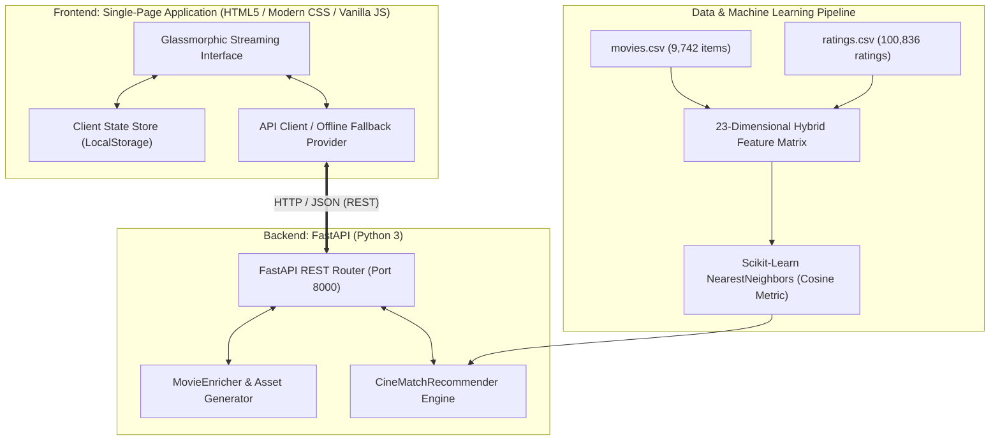

<div align="center">

# 🎬 CineMatch AI
### Next-Generation Luxury Streaming & Hybrid Movie Recommendation Platform

[](https://www.python.org/)
[](https://fastapi.tiangolo.com/)
[](https://scikit-learn.org/)
[](#)
[](#)
[](LICENSE)

<br/>

> **"Discover your next favorite story."**  
> *A high-performance full-stack web application transforming machine learning prototypes into an authentic luxury streaming experience inspired by Netflix, Letterboxd, Disney+, and IMDb.*

<br/>

```text
  ██████╗██╗███╗   ██╗███████╗███╗   ███╗ █████╗ ████████╗ ██████╗██╗  ██╗     █████╗ ██╗
 ██╔════╝██║████╗  ██║██╔════╝████╗ ████║██╔══██╗╚══██╔══╝██╔════╝██║  ██║    ██╔══██╗██║
 ██║     ██║██╔██╗ ██║█████╗  ██╔████╔██║███████║   ██║   ██║     ███████║    ███████║██║
 ██║     ██║██║╚██╗██║██╔══╝  ██║╚██╔╝██║██╔══██║   ██║   ██║     ██╔══██║    ██╔══██║██║
 ╚██████╗██║██║ ╚████║███████╗██║ ╚═╝ ██║██║  ██║   ██║   ╚██████╗██║  ██║    ██║  ██║██║
  ╚═════╝╚═╝╚═╝  ╚═══╝╚══════╝╚═╝     ╚═╝╚═╝  ╚═╝   ╚═╝    ╚═════╝╚═╝  ╚═╝    ╚═╝  ╚═╝╚═╝
```

[Live Demo](#-quick-start) • [Architecture](#-architecture--data-flow) • [Features](#-premium-features) • [Knowledge Base](#-ai-knowledge-base--documentation) • [API Docs](#-api-endpoints)

---

</div>

<br/>

## 🌟 Executive Overview

**CineMatch AI** bridges the gap between academic data science notebooks and consumer-grade streaming products. Powered by a **Hybrid k-Nearest Neighbors (k-NN)** model operating across a **23-dimensional feature space**, CineMatch AI delivers instantaneous personalized recommendations across **9,742 movies** and **100,836 user ratings** from the MovieLens catalog.

Designed with **Modern Glassmorphism aesthetics**, frosted glass cards (`rgba(255, 255, 255, 0.06)`), backdrop blurs, **Netflix Crimson Red accents (`#E50914`)**, and hardware-accelerated **60 FPS transitions**, CineMatch AI looks, feels, and operates like a commercial streaming venture.

---

## ⚡ Quick Start

### Prerequisites
- Python 3.10 or higher
- Modern web browser (Chrome, Edge, Firefox, Safari)

### Installation & Launch (1 Command)

```bash
# 1. Clone the repository
git clone https://github.com/AlaminM01/CineMatch-AI.git
cd CineMatch-AI

# 2. Install dependencies
pip install -r backend/requirements.txt

# 3. Launch application
python run.py
```

> **What happens next?**  
> `run.py` validates the dataset files, initializes the in-memory Scikit-Learn KNN index, starts the Uvicorn ASGI server on `http://localhost:8000`, and **automatically opens your default web browser** to the CineMatch AI streaming dashboard!

---

## 💎 Premium Features

### 🎨 Luxury Glassmorphism & UI/UX
- **Cinematic Dark Theme**: Crafted with deep canvas gradients (`#08080C` to `#141419`), subtle red glows, and cyan lighting.
- **Frosted Glass Cards**: Built with `backdrop-filter: blur(20px)` and soft volumetric drop-shadows.
- **60 FPS Hardware Acceleration**: Hover transforms (`translateY(-8px) scale(1.03)`) optimized on GPU composite layers.
- **Ambient Cinema Glow Mode**: Toggleable backlight ambiance button that casts soft radial light behind cards.
- **1.2s Branded Splash Screen**: Netflix-style soundwave and glowing logo reveal that smoothly fades into the hero presentation.

### 🧠 Explainable Hybrid Machine Learning
- **Explainable AI (XAI) Badges**: Every recommendation calculates an **AI Match Percentage** (55%–99%) along with a plain-English mathematical justification (e.g., *"Nearest Neighbors cosine similarity of 0.942 based on user rating vectors, shared Sci-Fi/Adventure traits, and year proximity"*).
- **Interactive AI Weight Tuner**: Sliders allowing users to adjust **Content/Genre Weight** vs. **Collaborative/Rating Weight** on the fly.
- **Personalized "Top Picks For You"**: Merges and re-ranks candidate pools based on items saved in the user's personal favorites.

### 🔍 Search & Exploration Experience
- **Typewriter Autocomplete**: Cycling animated placeholder with debounced real-time suggestions.
- **Keyboard Shortcut**: Press `/` or `Ctrl+K` anywhere on the screen to instantly jump focus into search.
- **Instant Multi-Filter**: Filter catalog by keywords, 19 genres, decade brackets (2010s, 2000s, 1990s, Classic), minimum star ratings, and Bayesian popularity.

### 🍿 Curated Emotional Mood Stations
Discover films tailored to your current state of mind:
- ⚡ **Adrenaline Rush**: High-octane Action & Thrillers.
- 🌀 **Mind Bending**: Thought-provoking Sci-Fi & Psychological Mysteries.
- ✨ **Feel Good**: Heartwarming Comedies & Animation.
- 🕶️ **Dark & Gritty**: Intense Crime, Film-Noir & Psychological Drama.
- 💖 **Heartfelt**: Moving Romance & Human Drama.
- 🚀 **Cosmic Wonder**: Epic Adventures & Fantasy Sagas.

### 🎬 Media & Interactive Engagement
- **Movie Details Modal**: Fullscreen cinematic layout featuring backdrops, storyline synopsis, cast, directors, and age ratings.
- **YouTube Trailer Player**: High-definition video player modal with automated background audio silencing.
- **Interactive Star Ratings**: Live 5-star rating widget with instant persistent client feedback.
- **Procedural SVG Poster Generator**: In-memory procedural vector poster generator ensuring zero broken image icons offline.
- **Persistent Library Drawers**: Favorites, Watchlist, Recently Viewed, and Search History saved locally.
- **Genre Analytics Dashboard**: Real-time visual charts displaying catalog density across 19 genres and ML hyperparameters.

---

## 📐 Architecture & Data Flow



---

## 🧮 Recommendation Mathematics

CineMatch AI unifies content attributes and community rating patterns into a **23-dimensional feature space**:

$$\mathbf{x} = \big[ \text{scaled\_year},\ \text{norm\_avg\_rating},\ \text{norm\_rating\_count},\ g_1, g_2, \dots, g_{20} \big]$$

### 1. Cosine Distance
The proximity between seed movie $\mathbf{u}$ and candidate $\mathbf{v}$ is evaluated in Euclidean space using the angle $\theta$:

$$d_{\text{cosine}}(\mathbf{u}, \mathbf{v}) = 1 - \frac{\mathbf{u} \cdot \mathbf{v}}{\|\mathbf{u}\|_2 \|\mathbf{v}\|_2} = 1 - \frac{\sum_{i=1}^{23} u_i v_i}{\sqrt{\sum_{i=1}^{23} u_i^2} \sqrt{\sum_{i=1}^{23} v_i^2}}$$

### 2. Genre Jaccard Overlap
To preserve thematic continuity, the categorical genre sets are scored via Jaccard intersection:

$$J(\text{Genres}_A, \text{Genres}_B) = \frac{|\text{Genres}_A \cap \text{Genres}_B|}{|\text{Genres}_A \cup \text{Genres}_B|}$$

### 3. Hybrid Blending Function
The final confidence score blends both dimensions according to user-selected weights $w_{\text{genre}}$ and $w_{\text{rating}}$:

$$\text{FinalScore} = \Big( w_{\text{genre}} \cdot J(\text{Genres}_A, \text{Genres}_B) \Big) + \Big( w_{\text{rating}} \cdot (1 - d_{\text{cosine}}) \Big)$$

$$\text{Match \%} = \text{clip}\Big( \text{round}(\text{FinalScore} \times 100),\ 55,\ 99 \Big)$$

---

## 🌐 API Endpoints

FastAPI automatically generates interactive Swagger API documentation accessible at `http://localhost:8000/docs`.

| Endpoint | Method | Description |
| :--- | :--- | :--- |
| `/api/health` | `GET` | Service liveness check and dataset confirmation. |
| `/api/stats` | `GET` | System scale, latency metrics, and feature dimensions. |
| `/api/movies/search` | `GET` | Advanced multi-filter search with sorting and pagination. |
| `/api/movies/recommend` | `GET` | KNN recommendations with customizable weights. |
| `/api/movies/recommend/personalized` | `POST` | Aggregated recommendations synthesized across favorites. |
| `/api/movies/trending` | `GET` | Bayesian-weighted community trending films. |
| `/api/movies/top-rated` | `GET` | All-time highest-rated classic films. |
| `/api/movies/moods` | `GET` | Recommendations filtered by psychological mood stations. |
| `/api/movies/genres` | `GET` | List of all 19 catalog genres. |
| `/api/movies/{movie_id}` | `GET` | Full movie details, trailer embed, cast, and similar row. |
| `/api/analytics/genres` | `GET` | Genre distribution and rating metrics. |

---

## 📁 Repository Structure

```text
Movie_recomendation/
├── backend/
│   ├── app.py                 # FastAPI application, CORS, static routes
│   ├── recommender.py         # KNN model, feature matrix, caching
│   ├── movie_enricher.py      # Metadata, cast, backdrops, procedural SVGs
│   └── requirements.txt       # Production dependencies
├── frontend/
│   ├── index.html             # Luxury Glassmorphic Single Page App
│   ├── css/style.css          # Glassmorphism, animations, 60 FPS CSS
│   └── js/
│       ├── api.js             # Async REST API client & offline fallback
│       ├── store.js           # LocalStorage pub/sub state management
│       └── app.js             # Main UI controller, modals, carousels
├── project_knowledge/         # High-Priority Knowledge Base
│   ├── PROJECT_OVERVIEW.md    # 5-minute high-level briefing
│   ├── AI_CONTEXT.md          # Machine-optimized AI knowledge base
│   ├── PROJECT_QA.md          # 110+ comprehensive viva & interview Q&As
│   ├── CHATGPT_PROMPT.txt     # Pre-engineered prompt for LLMs
│   ├── SYSTEM_ARCHITECTURE.md # Standardized Mermaid.js diagrams
│   ├── CHANGELOG.md           # Detailed versioning history
│   ├── PROJECT_LOG.md         # Chronological engineering log
│   └── QUICK_START_FOR_AI.md  # 1-2 page compact cheat sheet
├── movies.csv                 # MovieLens 9,742 movie catalog
├── ratings.csv                # MovieLens 100,836 user ratings
├── movie_recommendation.ipynb # Legacy prototyping notebook
├── run.py                     # Single-command launcher
└── README.md                  # GitHub showcase
```

---

## 📚 AI Knowledge Base & Documentation

A dedicated `/project_knowledge` directory is provided for hackathons, viva preparation, placements, and AI ingestion:

- 📄 **[Project Overview](project_knowledge/PROJECT_OVERVIEW.md)**: High-level executive summary, problem statement, and solution.
- 🤖 **[AI Context](project_knowledge/AI_CONTEXT.md)**: Machine-optimized single source of truth for ChatGPT, Claude, and Copilot.
- 🎓 **[110+ Project Q&A](project_knowledge/PROJECT_QA.md)**: Exhaustive interview and viva preparation covering 12 technical categories.
- 💬 **[ChatGPT Prompt](project_knowledge/CHATGPT_PROMPT.txt)**: Ready-to-use prompt configuring any AI assistant as a CineMatch AI expert.
- 📐 **[System Architecture](project_knowledge/SYSTEM_ARCHITECTURE.md)**: Complete Mermaid.js data flow, sequence, and component diagrams.
- 📝 **[Changelog](project_knowledge/CHANGELOG.md)**: Milestone release records and improvements.
- 📜 **[Development Log](project_knowledge/PROJECT_LOG.md)**: Chronological engineering decision log.
- ⚡ **[Quick Start for AI](project_knowledge/QUICK_START_FOR_AI.md)**: Compact 2-page briefing.

---

## 🤝 Contributing

Contributions, issues, and feature requests are welcome!
1. Fork the Project (`git checkout -b feature/AmazingFeature`)
2. Commit your Changes (`git commit -m 'Add some AmazingFeature'`)
3. Push to the Branch (`git push origin feature/AmazingFeature`)
4. Open a Pull Request

---

## 📄 License

Distributed under the MIT License. See `LICENSE` for more information.

<br/>

<div align="center">
  <b>Designed with ❤️ for Cinephiles and Engineers alike.</b><br/>
  <i>CineMatch AI — Discover your next favorite story.</i>
</div>
