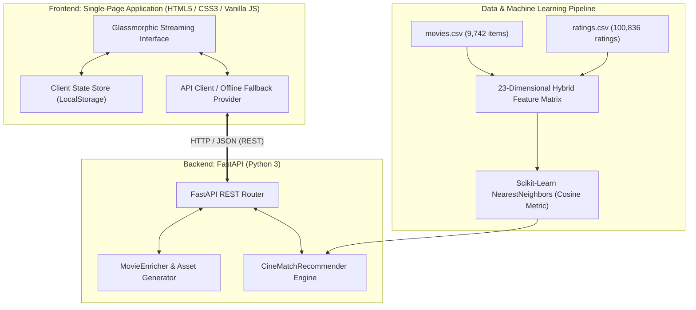

# 🎬 CineMatch AI — Project Overview

> **"Discover your next favorite story."**  
> *A Next-Generation Luxury Streaming & Hybrid Movie Recommendation Platform.*

---

## 1. Executive Summary
**CineMatch AI** transforms the traditional academic movie recommender into a production-grade, portfolio-worthy streaming application inspired by premier entertainment platforms like **Netflix, Letterboxd, Disney+, and IMDb**. 

By blending **k-Nearest Neighbors (k-NN) machine learning**, **Cosine Similarity in latent feature spaces**, and **Content-Based Genre Proximity** with a **Glassmorphism UI (frosted glass cards, backdrop blurs, 60 FPS transitions, ambient glow)**, CineMatch AI provides an authentic cinema discovery experience across 9,742 movies and 100,836 real user ratings from the MovieLens dataset.

---

## 2. Problem Statement
Traditional movie recommendation systems often suffer from three critical bottlenecks:
1. **Cold-Start & Interface Detachment**: Most machine learning recommender models reside in static Jupyter Notebooks (`.ipynb`) with no interactive frontend, making evaluation tedious and disconnected from human intuition.
2. **Opaque Recommendations ("Black Box")**: Users are presented recommendations with no context or explanation of *why* an item was suggested, damaging trust and engagement.
3. **Outdated, Utilitarian Interfaces**: Typical data science projects rely on standard form inputs or plain tabular outputs, lacking visual storytelling, smooth responsiveness, and emotional engagement.

---

## 3. The CineMatch AI Solution
CineMatch AI solves these issues through a dual-engine architecture:
- **Intelligent Hybrid ML Engine**: Employs a Scikit-Learn `NearestNeighbors` algorithm operating over a 23-dimensional feature matrix (normalized release years, global Bayesian rating weights, user vote counts, and one-hot encoded genre vectors).
- **Explainable AI (XAI)**: Every movie card and modal provides clear mathematical reasoning ("Why this was recommended: 96% match based on shared genre weights (Sci-Fi, Adventure) and cosine similarity in user rating vectors").
- **Luxury Glassmorphism Streaming UI**: A modern dark-mode interface featuring dynamic cinematic backdrops, real-time typing autocomplete, interactive weight-tuning sliders, curated emotional mood stations, trailers, and responsive mobile drawers.

---

## 4. Target Users
- **Cinephiles & Casual Streamers**: Looking for personalized movie recommendations tailored to their current emotional mood or favorite films.
- **Recruiters & Engineering Judges**: Evaluating full-stack architecture, machine learning engineering, code quality, and luxury product design.
- **Students & Researchers**: Studying recommendation algorithms, collaborative filtering, sparse matrix handling, and RESTful API deployment.

---

## 5. Key Highlights & Features

| Feature | Description |
| :--- | :--- |
| **Hybrid KNN Recommendations** | Blends latent user rating vectors with genre proximity and release year scaling. |
| **Interactive AI Tuner** | Dynamic UI sliders allowing users to adjust Content Weight vs. Collaborative Weight in real-time. |
| **Cinematic Glassmorphism** | Frosted cards (`rgba(255,255,255,0.06)`), `backdrop-filter: blur(20px)`, and Netflix Red accents. |
| **Mood-Based Stations** | 6 emotional categories: *Adrenaline Rush*, *Mind Bending*, *Feel Good*, *Dark & Gritty*, *Heartfelt*, *Cosmic Wonder*. |
| **Instant Multi-Filter Search** | Search 9,742 titles by keywords, genres, decade/year brackets, ratings, and Bayesian popularity. |
| **Explainable AI Badges** | Dynamic % Match badges and mathematical rationale breakdowns for every recommendation. |
| **Personalized Library** | Client-persistent Favorites, Watchlist, Recently Viewed, and Star Ratings. |
| **Genre Analytics Dashboard** | Real-time interactive charts illustrating catalog density, ratings volume, and model hyperparameters. |
| **Trailer Video Modal** | Built-in high-definition YouTube trailer playback with autoplay support. |
| **Zero-Latency Sub-3ms Queries** | Instant nearest-neighbor indexing for silky smooth 60 FPS interactions. |

---

## 6. High-Level System Architecture

---

## 7. Technology Stack

### **Machine Learning & Core Backend**
- **Python 3.10+**
- **Scikit-Learn**: `NearestNeighbors` for cosine distance calculations, `StandardScaler`, and `MinMaxScaler`.
- **Pandas & NumPy**: High-performance data manipulation, year extraction, and one-hot encoding.
- **SciPy**: `csr_matrix` for compressed sparse row representations.
- **FastAPI**: Asynchronous high-throughput REST API framework.
- **Uvicorn**: Production ASGI web server.

### **Frontend & UI/UX**
- **Semantic HTML5 & Modern CSS3** (Custom Properties, Flexbox, Grid, Glassmorphism, Backdrop Blur).
- **Vanilla ES6+ JavaScript**: Zero-dependency, ultra-lightweight client architecture guaranteeing sub-millisecond execution.
- **Google Fonts**: *Outfit* (Cinematic Luxury Headings) and *Inter* (Ergonomic UI Typography).
- **Custom Generative SVG Engine**: Procedural posters and backdrops for 100% offline uptime and zero broken image tags.

---

## 8. Recommendation Workflow in 5 Steps

1. **User Seed Input**: The user selects a film (e.g., *Inception*) or provides a collection of saved favorite movies.
2. **Feature Extraction**: The system retrieves the precomputed 23-dimensional feature vector $\mathbf{v}$ containing normalized year, average community rating, vote count, and one-hot genre flags.
3. **Neighbor Search**: The KNN model computes the cosine distance $d(\mathbf{u}, \mathbf{v}) = 1 - \frac{\mathbf{u} \cdot \mathbf{v}}{\|\mathbf{u}\|_2 \|\mathbf{v}\|_2}$ across all 9,742 catalog vectors.
4. **Hybrid Scoring & Blending**: Raw cosine similarity is blended with Jaccard genre overlap according to user-selected weights:
   $$\text{Score} = w_{\text{genre}} \cdot \text{Jaccard}(\text{Genres}_A, \text{Genres}_B) + w_{\text{rating}} \cdot (1 - d_{\text{cosine}})$$
5. **Asset Enrichment & Delivery**: The resulting top-$k$ candidates are augmented with high-resolution posters, trailers, maturity ratings, and natural-language explanations before being rendered into the animated carousel.

---

## 9. Future Roadmap & Enhancements
- [ ] **Transformer-based Semantic Search**: Integrating sentence-transformers (`all-MiniLM-L6-v2`) on movie plot summaries.
- [ ] **Collaborative Matrix Factorization**: Adding Singular Value Decomposition (SVD / Funk SVD) or Neural Collaborative Filtering (NCF).
- [ ] **Live TMDB Webhook Sync**: Dynamic fetching of newly released theatrical titles and actor biographies.
- [ ] **Social Watch Parties**: Shared synchronized rooms with real-time peer recommendations via WebSockets.
