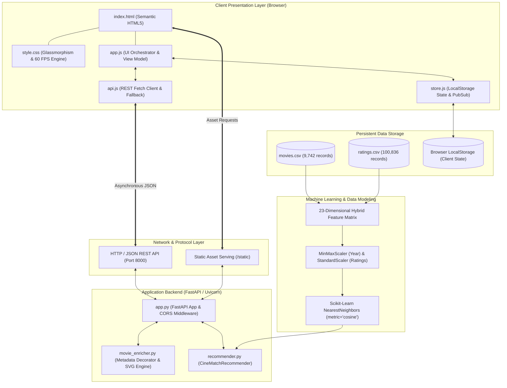
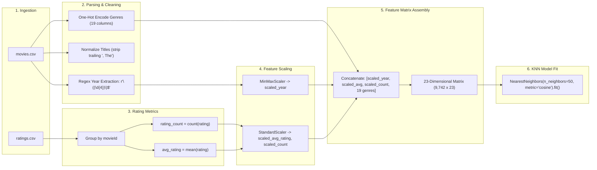
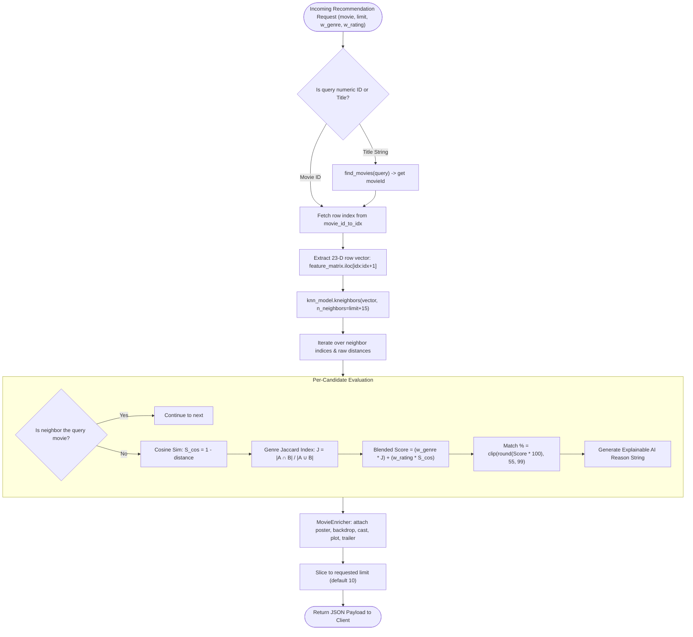
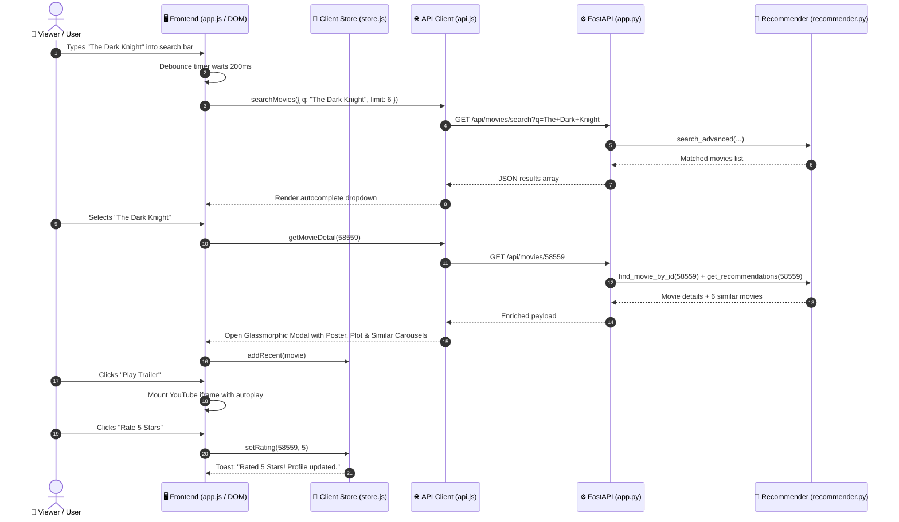
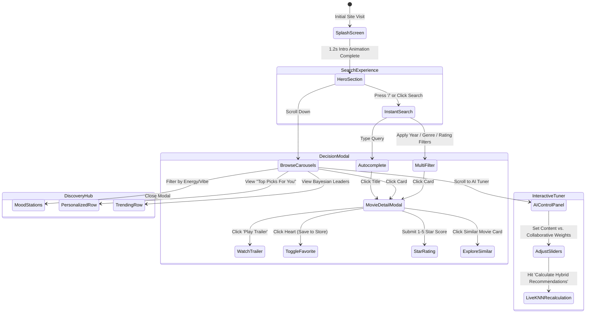
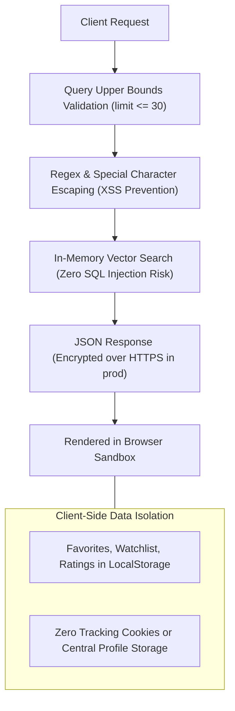

# 📐 CineMatch AI — System Architecture & Engineering Diagrams

This document outlines the software architecture, data pipelines, algorithmic workflows, component interactions, and user journeys of CineMatch AI using standardized **Mermaid.js** diagrams.

---

## 1. High-Level System Architecture

The following diagram illustrates the decoupled client-server architecture of CineMatch AI, showing the separation of concerns between client persistence, API routing, machine learning models, and data storage.

---

## 2. End-to-End Data Pipeline & Feature Engineering

This diagram depicts how raw CSV files are ingested, transformed, normalized, and indexed into the vector feature space.

---

## 3. Hybrid Recommendation Engine Workflow

The following flowchart illustrates the step-by-step logic executed when a user requests recommendations for a film, highlighting the blend between Latent Space Cosine Similarity and Content-Based Jaccard Overlap.

---

## 4. Component Interaction Diagram (Sequence)

This sequence diagram displays the asynchronous lifecycle of a user searching for a movie, adjusting weights, and playing a trailer.

---

## 5. User Journey & Discovery Flowchart

This state diagram maps the user experience paths through CineMatch AI.

---

## 6. Security & Data Protection Architecture

